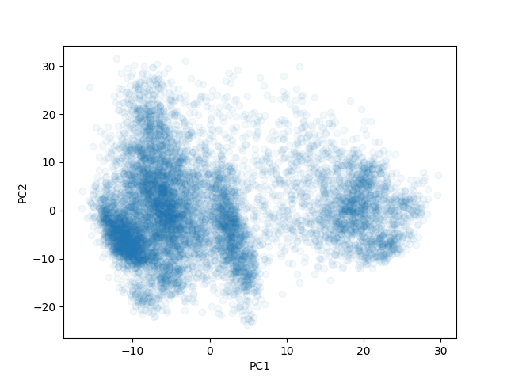
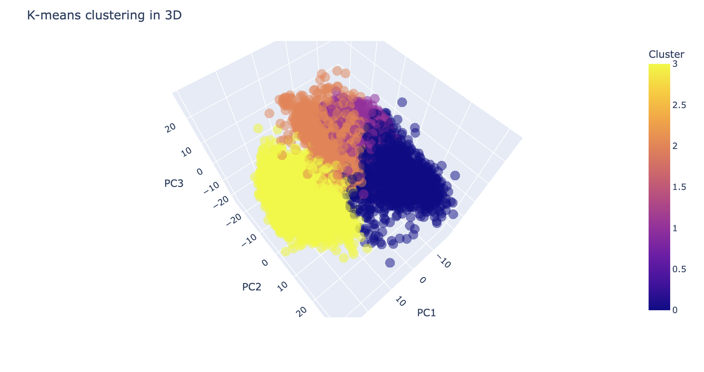

### 1. State topic you chose for your project

```
The topic I choose is to explore is Kmeans clustering to identify distinct groups of cells 
based on the gene expression patterns.
```

### 2. Describe your original plan from your project proposal. What did you plan on doing for the project originally?

```
I planned to take the gene expression data and create clusters based on the kmeans approach.
By taking arbitary points as centroids and fine tuning the points based on the distances to
arrive at the right set of centroids that can categorise the data into distinct groups
based on similarity.
```

### 3. Describe any challenges that came up while doing your project. Did you run into any
obstacles that stopped you from completing your full project plan, or threw you off
course? How did you deal with them?

```
I faced dificulty in getting the kmeans right, the points were not converging quick,
as the data i took has many columns the computation was taking lot of time. Then i 
resorted to numpy array based calculations to make the computation fast and also 
while choosing the initial centroids i choose the mean of groups based on the order
and then tried to convege on them that made it faster to converge.
```

### 4. Provide a detailed explanation of what you did to address your project topic, as well as
reasoning for the decisions you made. For example, if you downloaded a genome, why
did you choose that genome? If you ran a script with various parameters, what were the
parameters, and why did you choose them?

```
Based on the lecture material provided by you i created the code to create centroids and tried to 
converge them based on the distances. As the gene expression has many fields, to make the computation 
faster i used numpy library to make the computation faster reducing the code footprint as well.

I tried to make clusters of size 2,3, and 4 also tired to view the results in 3d and 2d graphs.

Based on the observation the final result seems to identify the cells based on the cluster, even though there
are some outliers this can be used as basis for identifying the cell type.
```

### 5. Provide a detailed description of your results. What conclusions can you draw? Based
on what data?

```
The program i wrote is producing the cluster labels to the gene expression data which is able 
to cluster similar items together in most of the cases. Using eculidean distance the cluster centorids 
are adjusted to come up with the right groupings of the data. producing the following results.
```




### 6. Suggest some “future directions”: questions related to your project that someone who
was interested in the topic might be interested in pursuing in the future.

```
The distance metric used to calculate the distance between the data points and centroids may not be appropriate. 
In this implementation, the Euclidean distance is used, which may not be appropriate for all datasets. 
It may be worth experimenting with other distance metrics such as Manhattan or Cosine distance.

The data may have outliers or noise, which can affect the performance of the algorithm. 
It may be helpful to preprocess the data to remove outliers

The value of k may not be appropriate for the dataset. Choosing an appropriate value of k is crucial for the 
algorithm to converge. Using techniques such as the elbow method or silhouette score can help to determine the
optimal value of k for the dataset.
```

