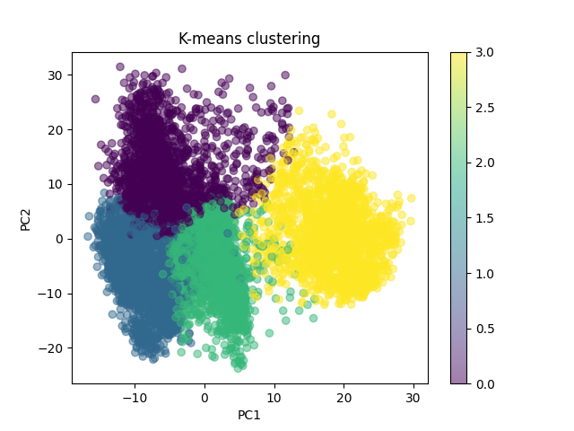

# Computational Biology
### Installation instructions
```shell
wget https://raw.githubusercontent.com/juliaolivieri/COMP_293C_Computational_Biology/main/project/clustering/gene_expression.csv.gz
wget https://raw.githubusercontent.com/juliaolivieri/COMP_293C_Computational_Biology/main/project/clustering/cell_types.txt
wget https://raw.githubusercontent.com/juliaolivieri/COMP_293C_Computational_Biology/main/project/clustering/gene_names.txt
gunzip *.gz

conda create --name comp_bio   
pip install -r requirements.txt
```

### Kmeans of gene expression

[custom implementation](./clustering_using_sklearn.ipynb)

[sklearn implementation](./kmeans_custom_implementation.ipynb)



